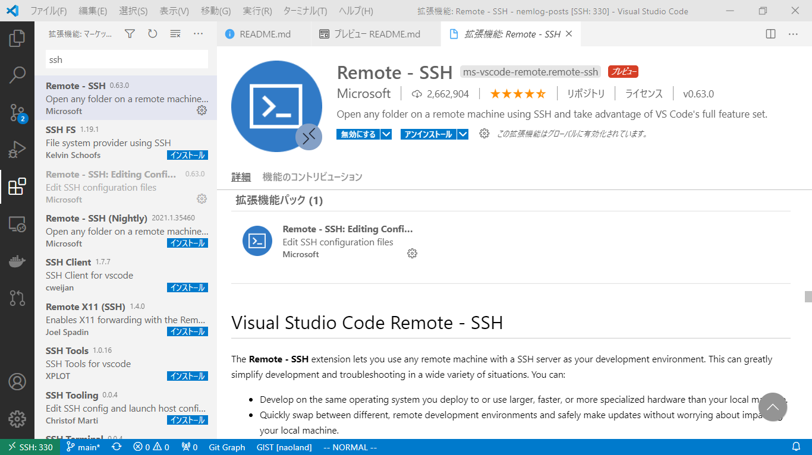
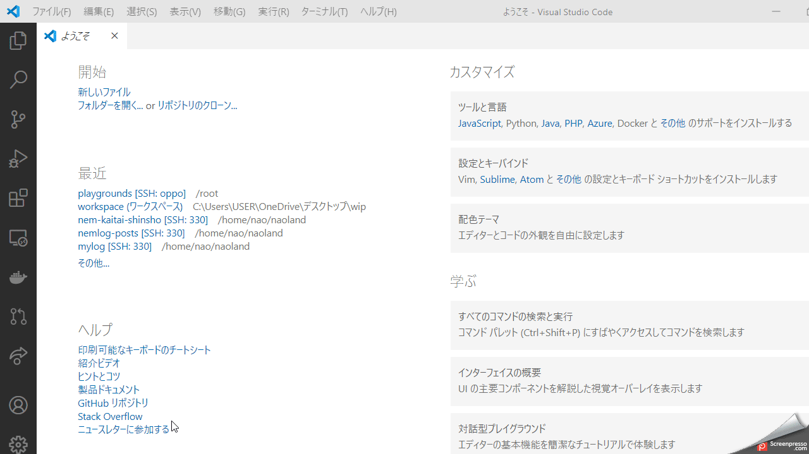

# 【TIPS#3】 アンドロイドスマホ上のLinuxにVSCodeで接続してみよう

VSCodeからTermuxに接続します。

## はじめに

[Tips#1](#関連情報へのリンク)では[Termux](#関連情報へのリンク)をインストールしてAndroidスマホに`Linux`と`Python`の環境を導入し、前回の[TIPS#2](#関連情報へのリンク)ではPCのターミナルソフトから、アンドロイドスマホ上のLinuxにSSHで接続し、簡単なPythonコードを実行しました。

今回はVScodeから、アンドロイドスマホ上のLinuxに接続し、簡単なPythonコードをデバッグしてみます。VSCodeで開発できるとなればより実践的な目的で利用できそうで楽しみですね。

ただ初回だけ環境構築が結構面倒くさいのですが、頑張ってついてきてください。
また、説明している内容は難しく見えるかもしれませんが、実際に作業してみると意外とかんたんです。
さあ、面倒くさいことはさっさと終わらせて、楽しそうな世界に向かいましょう！

[Termux](#関連情報へのリンク)のインストールが終わっていない、PCからTermux端末にSSH接続できていない方は、以前の[Tips記事](#関連情報へのリンク)を参照してください。

VSCodeからTermux端末にSSH接続する手順はおおよそ次のようになります。

- PCからTermux端末にSSHで接続できるか再確認します
- SSHキーペア（公開鍵と秘密鍵）を作成します
- VSCodeの拡張機能をインストールします
- SSH構成ファイルを作成します
- Ubuntu仮想環境（proot）をインストールします
- VSCodeからTermux端末にSSH（リモート）接続します
- 簡単なプログラムを書いて、デバッグを実行してみます

作業は**アンドロイド側とPC側の両方**ありますのでご注意ください。

## PCからTermux端末にSSHで接続できるか再確認します

PCのターミナルからSSH公開鍵を使用せずに接続できるか確認します。

前回の記事で紹介している方法で、アンドロイドスマホ側のユーザ、IPアドレス、ポート番号を確認し`ssh`コマンドで接続を確認します。`ssh`コマンドはWindows 10にも標準インストールされています。

```
> ssh u0_a182@192.168.1.3 -p 8022
```
アクセスが成功した場合の挙動は、前記事をご確認ください。


## SSHキーペア（公開鍵と秘密鍵）を作成します

SSHの設定をするために、RSA方式でSSHの秘密鍵と公開鍵のペアを作ります。

次のコマンドにて鍵長が2048以上かつ、暗号化方式が`RSA`の公開鍵と秘密鍵のペアを作成します。
PCのターミナル（PowerShell）で行ってください。

例）

```powershell
> ssh-keygen.exe -t rsa
```

保存先の入力を求められるので、`.ssh/id_rsa_test`などとします。
デフォルトは`.ssh/id_rsa`ですが、すでに存在していた場合、上書きされてしまうのでこのように別の名前をつけた方がよいでしょう。

この場合、`C:\Users\USER/.ssh/id_rsa_test` に公開鍵と秘密鍵が作成されます。

    Enter file in which to save the key (C:\Users\USER/.ssh/id_rsa): .ssh/id_rsa_test

またパスワード（パスフレーズ）の入力を求められますが、何も入力せずEnterキーをタイプします。

    Enter passphrase (empty for no passphrase):
    Enter same passphrase again:

実行例）

```powershell
> ssh-keygen.exe -t rsa

Generating public/private rsa key pair.
Enter file in which to save the key (C:\Users\USER/.ssh/id_rsa): .ssh/id_rsa_test
Enter passphrase (empty for no passphrase):
Enter same passphrase again:
Your identification has been saved in .ssh/id_rsa_test.
Your public key has been saved in .ssh/id_rsa_test.pub.
The key fingerprint is:
SHA256:D1Z/NkFNfBN5fRhdTLUwaxENYWDPAEptIC+WyTII/6M user@330s
The key's randomart image is:
+---[RSA 2048]----+
|.    . oo..+.OB@@|
|... . * .o. =.*+@|
| ..o * o. .  =..=|
|   .+ .  . ..  . |
|    o   S   . +  |
|   . . . o   o . |
|  E       .      |
|                 |
|                 |
+----[SHA256]-----+
```

公開鍵と秘密鍵が作成できたか確認します。

```
> dir C:\Users\USER/.ssh/id_rsa_test*


    Directory: C:\Users\USER\.ssh


Mode                 LastWriteTime         Length Name
----                 -------------         ------ ----
-a----           21/1/27     17:34           1679 id_rsa_test
-a----           21/1/27     17:34            392 id_rsa_test.pub

```

`id_rsa_test`が秘密鍵、`id_rsa_test.pub`が公開鍵です。無事に作成できていることを確認しました。

ちなみに、秘密鍵と公開鍵はホームディレクトリのトップの`.ssh`というディレクトリに保存することが慣例的に決まっていますので、特別な理由がない限り従いましょう。

鍵のデフォルトの保管先

```
Windows 10の場合
C:\Users\ユーザ名/.ssh

Unixの場合
/home/ユーザ名/.ssh
```

## VSCodeの拡張機能をインストールします

VSCodeの拡張機能`Remote - SSH`をインストールしてください。

インストール方法は次を参照してください。

[Remote - SSH - Visual Studio Marketplace](https://marketplace.visualstudio.com/items?itemName=ms-vscode-remote.remote-ssh)




## SSH構成ファイルを作成します

SSH構成ファイル（config）を作成しておくと、秘密鍵を使った特定のサーバーへのログインが簡単になります。
特定のサーバーとは、今回の場合はTermuxをインストールしたアンドロイドスマホのことです。

SSH構成ファイルの保存先は次の通りです。

macOS & Linux  
`~/.ssh/config`

Windows 10  
`C:\Users\ユーザ名/.ssh/config`


次の例で示す簡単な構成を使うと、既定の`SSH秘密キー`を使って、特定のサーバーにユーザーとしてすばやくサインインできます。
SSH構成ファイルにサーバー情報と秘密鍵の設定を行います。

例）SSH構成ファイル
```
Host oppo
    HostName 192.168.1.3
    User u0_a182
    Port 8022
    IdentityFile ~/.ssh/id_rsa_test

```

上記の設定例で使用されている、サーバー名以外の情報の取得、確認方法は前回の記事をご覧ください。
なぜサーバー名が`oppo`かというと、私の使っているスマホのメーカーが`Oppo`だからですｗ。

項目名 | 設定例 | 説明`
---|---|---
Host | oppo | サーバー名 
HostName | 192.168.1.3 | IPアドレス
User | u0_a182 | ユーザ名
Port | 8022 | ポート番号
IdentityFile | ~/.ssh/id_rsa_test | SSH秘密鍵のファイル名

SSH構成ファイルはエディターを使用して記述します。
VSCodeを新規に起動してください。
そして、画面左下の赤で囲んだ部分のボタンをクリックしてください。


`Remote-SSH Open Configuration File`を選択してください（Openではなく、Createと表示されるかもしれません）。


SSH構成ファイル `C:\Users\ユーザ名/.ssh/config` が一番上にあると思うので、それを選択します。


最初は中身が空っぽだと思いますが、すでに他の目的でSSHをご利用の方の場合は、設定内容が表示されると思います。

今回は、先ほどの構成例をコピペします。


内容を保存しましょう


## Ubuntu仮想環境（proot）をインストールします

Termux端末に本物のUbuntuの仮想環境をインストールします

Termux側で次のコマンドを実行する必要がありますｗ。
ここは別記事でご紹介することにしますが、今回はこんなことするという感触だけ。。


```
- Update termux: apt-get update && apt-get upgrade -y
- Install wget: apt-get install wget -y
- Install proot: apt-get install proot -y
- Install git: apt-get install git -y
- Go to HOME folder: cd ~
- Download script: git clone https://github.com/MFDGaming/ubuntu-in-termux.git
- Go to script folder: cd ubuntu-in-termux
- Give execution permission: chmod +x ubuntu.sh
- Run the script: ./ubuntu.sh -y
- Now just start ubuntu: ./startubuntu.sh
```


### Ubuntuの仮想環境内でSSHサーバーを起動します
- Ubuntuの仮想環境内に`openssh-server`をインストール
  - `apt install -y openssh-server`
- （Androidが非root端末なら）ポート番号を1024以上にして`sshd`を起動
- VSCodeからUbuntuの仮想環境のシェルに入る

ここの説明も次回追記します。

## VSCodeからTermux端末にSSH（リモート）接続します

簡単なプログラムを書いて、デバッグを実行してみます





## まとめ


いかがでしたでしょうか？
後半かなり疲れてしまったので、だらだらになってしまいましたが、ちゃんと追加で説明記事を出そうと思います。

いずれにしましても、VSCodeからアンドロイドスマホ上のLinuxにアクセスして、コードを書いて、デバッグ＆実行できるという事実はご覧いただけたと思います。
そして、準備がごちゃごちゃありますが、1回だけなので頑張ってください。

Pythonだけではなく、Node.jsなども動作しますので、なんか楽しいですねｗ。

モバイルAPIにアクセスして、役に立ちそうなコードの紹介もしておりますので、お楽しみに。


## 関連情報へのリンク

- [【TIPS#1】 アンドロイドスマホにLinuxとPythonを導入してみよう](https://nemlog.nem.social/blog/54849)
- [【TIPS#2】 アンドロイドスマホ上のLinuxにターミナルで接続してみよう](https://nemlog.nem.social/blog/54919)
- [公式サイト（英語）](https://termux.com/)
- [Termux Wiki](https://wiki.termux.com/wiki/Main_Page)
- [Termux - Google Play のアプリ](https://play.google.com/store/apps/details?id=com.termux&hl=ja)
- [Visual Studio Code - Code Editing. Redefined](https://code.visualstudio.com/)
- [Developing on Remote Machines using SSH and Visual Studio Code](https://code.visualstudio.com/docs/remote/ssh#_getting-started)
- [MFDGaming/ubuntu-in-termux: This is a script by which you can install Ubuntu in your termux application without a rooted device](https://github.com/MFDGaming/ubuntu-in-termux)
- [Remote - SSH - Visual Studio Marketplace](https://marketplace.visualstudio.com/items?itemName=ms-vscode-remote.remote-ssh)


## 用語

Termux端末とは、TermuxでインストールしたLinuxが稼働中のアンドロイドスマホの事です。

Termuxは、Androidターミナルエミュレーターであり、最小構成のLinux環境アプリです。


